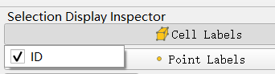
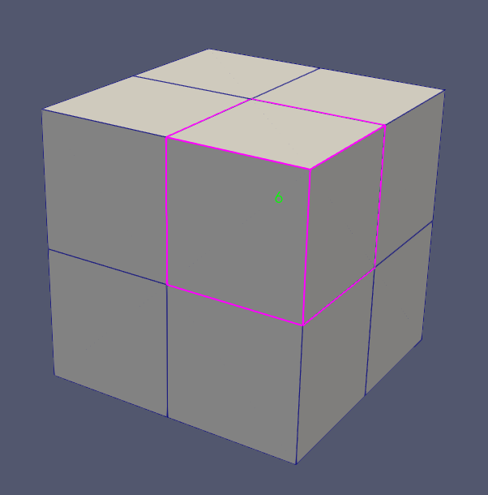
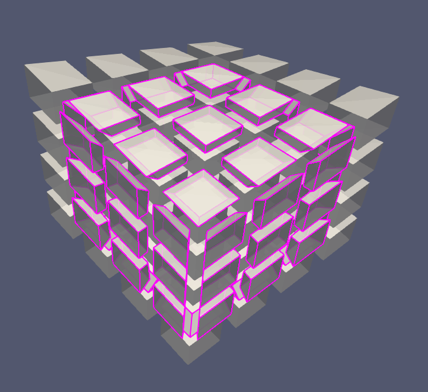
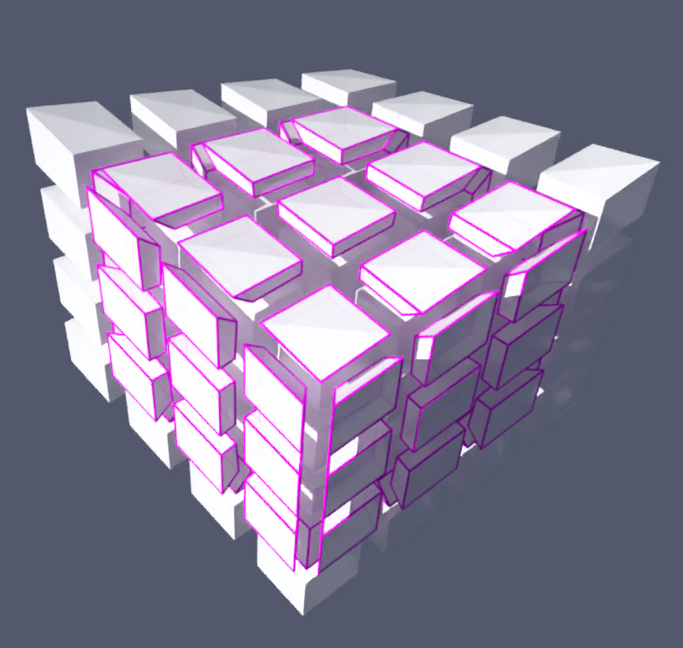
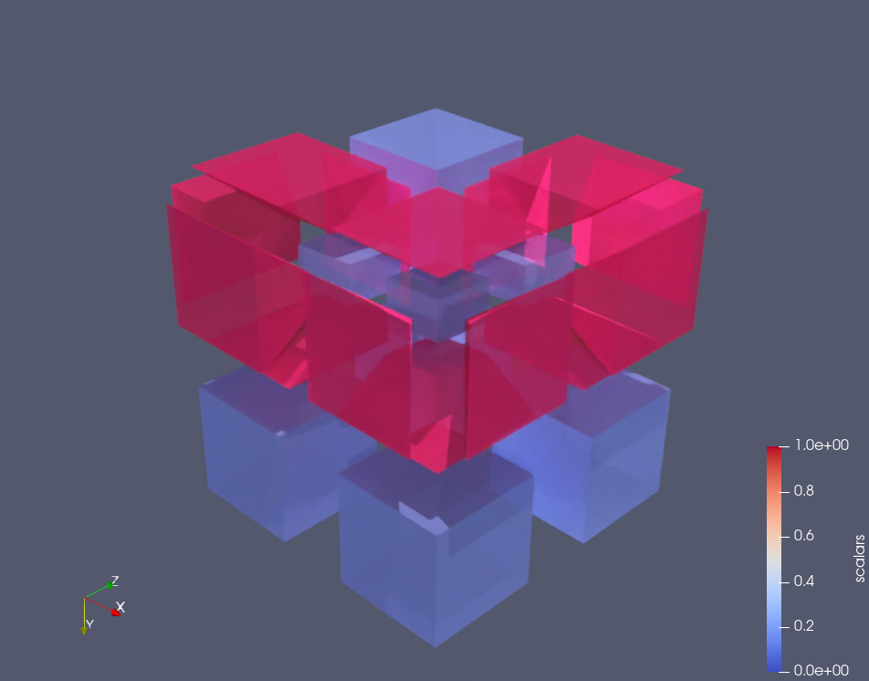

# Hex Padding

Implement **Hex mesh padding/shrinking/pillowing** algorithm

Pad marked cells then do smoothing

#### Reference

-  Gianmarco Cherchi, Pierre Alliez, Riccardo Scateni, Max Lyon, David Bommes. **Selective Padding for Polycube-Based Hexahedral Meshing**. Computer Graphics Forum, Wiley, 2019, ff10.1111/cgf.13593ff. ffhal-01970790f
- MITCHELL S. A., TAUTGES T. J.: **Pillowing doublets: refining a mesh to ensure that faces share at most one edge**. In 4th International Meshing Roundtable (1995), Citeseer, pp. 231–240.

#### Libraries

- VTK
- Eigen

#### I/O

- **INPUT**: <kbd>.vtk</kbd> unstructured hex mesh file & <kbd>.txt</kbd> contains indexes of target cells
- **OUTPUT**: <kbd>.vtk</kbd> padded unstructured hex mesh file
- <kbd>-i arg</kbd> : input vtk file, arg: input file name, default: <kbd>../data/64cube.vtk</kbd>
- <kbd>-o arg</kbd> : output vtk file, arg: output file name, default: <kbd>output.vtk</kbd>
- <kbd>-t arg</kbd> : target cell indexes in txt file, arg: target txt file name, default: <kbd>../data/64cube_target.txt"</kbd>
- <kbd>-s</kbd>   : smooth the padded mesh
- <kbd>-m</kbd>   : output mesh with padded element marked using scalar 1
- <kbd>-h</kbd>   : help

you could change the macro in HexPadding.cpp to change the number of smoothing time and shrink ratio when padding 

using command line to choose input and output files, a example command is like follow:

```shell
./Padding.exe -i "../data/rod.vtk" -o "smoothed_padded_rod.vtk" -t "../data/rod_target.txt" -s -m
```

#### How to mark cells

Here is one method to get indexes of cells

1. Open the target mesh using **ParaView**
2. Click the button <kbd>Select Cells On</kbd> on the top of the display window 
3. You will see Selection Display Inspector on the right of the display window. Click <kbd>Cell Labels</kbd> and tick the ID option :white_check_mark:



4. Then you will see the index when your cursor is on the cell. Write cell indexes into a txt file then run the program.



#### Results





padded element marked 



